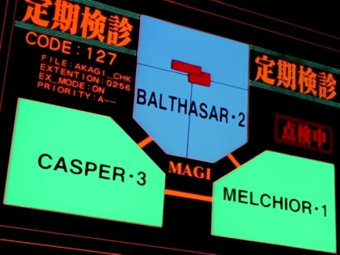

# Naoko: 듀얼 에이전트 AI 아키텍트 시스템


**Naoko**는 전문적인 소프트웨어 엔지니어링 워크플로우를 시뮬레이션하기 위해 설계된 자동화 코딩 오케스트레이션 시스템입니다. 두 개의 특화된 AI 에이전트가 엄격한 협업 루프에서 동작하며, 코드 품질과 요구사항 준수를 보장합니다.

## 🧠 핵심 철학

Naoko는 "사고(기획/리뷰)"와 "실행(코딩)"을 분리하여, LLM이 요구사항을 환각하거나 검증되지 않은 코드를 작성하는 문제를 방지합니다.

- **Gemini 에이전트(아키텍트):** 기획 문서(PDF, PPTX, XLSX)를 읽고 요구사항을 추출하며 엄격한 코드 리뷰를 수행합니다.
- **Codex 에이전트(개발자):** 요구사항을 바탕으로 코드를 구현하고 Git 패치를 적용하며, 리뷰 피드백에 따라 반복 수정합니다.

## 🔄 워크플로우

시스템은 안정성을 고려한 상태 머신으로 동작합니다.

1.  **기획 단계:**
    - 입력: 기획 문서(PDF, MD, Excel).
    - 출력: 구조화된 `development_request.md`.
2.  **구현 단계:**
    - 동작: Codex 에이전트가 코드를 생성하고 `patch.diff`를 만듭니다.
    - 검증: 시스템이 패치 형식(Unified Diff)을 검증하고 적용합니다.
3.  **리뷰 루프(반복 개선):**
    - **리뷰:** Gemini가 요구사항과 diff를 비교 분석합니다.
    - **판단:** Codex가 리뷰를 판정(Suitable/Changes Needed/Hold/Unnecessary)합니다.
    - **반복:** 최대 5회까지 반복하며 `SUITABLE` 판정 시 종료합니다.
4.  **완료:**
    - 요약된 메시지로 Git 커밋을 자동 생성합니다.

## 📂 프로젝트 구조

```text
/naoko
├── artifacts/              # 중간 산출물(요구사항, 패치, 리뷰)
├── docs/                   # 기획 문서를 여기에 둡니다
├── naoko_core/             # 시스템 소스 코드
│   ├── agents/             # Gemini/Codex 클라이언트 래퍼
│   ├── io/                 # Git 작업 및 파일 I/O
│   └── orchestrator.py     # 메인 워크플로우 상태 머신
├── requirements.txt        # Python 의존성
└── README.md
```

## 🚀 시작하기

### 사전 준비
- Python 3.9 이상
- Git 설치 및 기본 설정 완료

### 설치

1. 저장소 클론:
   ```bash
   git clone https://github.com/TODOTODoTOdoTodotodo/agent-naoko.git
   cd agent-naoko
   ```

2. 가상환경 설정:
   ```bash
   python3 -m venv .venv
   source .venv/bin/activate  # Windows: .venv\Scripts\activate
   ```

3. 의존성 설치:
   ```bash
   pip install -r requirements.txt
   ```

### 사용 방법

기획 문서를 지정해 시스템을 실행합니다.

```bash
# 샘플 기획서로 실행
python -m naoko_core.main docs/sample_project_plan.md

# 옵션
# --max-rounds 3   : 리뷰 루프를 3회로 제한(기본 5회)
# --dry-run        : git 패치 적용 없이 시뮬레이션
```

## ⚠️ 현재 상태 (v0.1.0)

이 프로젝트는 **초기 프로토타입** 단계입니다.
- **코어 오케스트레이터:** 구현 및 검증 완료
- **Git 작업:** 구현 완료(Unified Diff 검증 포함)
- **에이전트 로직:** 구조 검증을 위한 시뮬레이션 동작(더미 응답). 실제 LLM API 연동이 다음 단계입니다.

## 🤝 기여 방법

기여를 환영합니다. Pull Request를 보내주세요.

1. 프로젝트 Fork
2. 기능 브랜치 생성 (`git checkout -b feat/AmazingFeature`)
3. 변경사항 커밋 (`git commit -m 'feat: Add some AmazingFeature'`)
4. 브랜치 푸시 (`git push origin feat/AmazingFeature`)
5. Pull Request 생성
